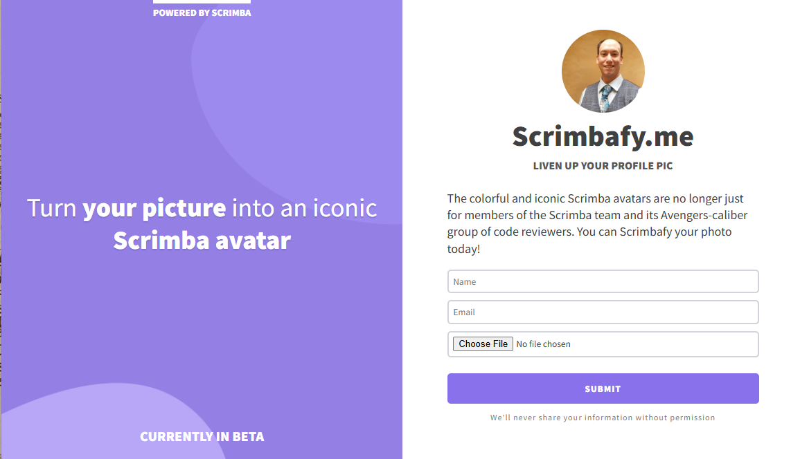

# Scrimbafy Me

Transform your profile picture into an iconic Scrimba-style avatar with this sleek landing page application.

## 🎨 About

Scrimbafy Me is a web application that allows users to convert their photos into colorful, iconic Scrimba avatars. The project features a beautiful split-screen design with a purple gradient background and a clean, user-friendly interface.

## ✨ Features

- **Responsive Design**: Adapts beautifully to both mobile and desktop screens
- **Clean UI**: Modern, minimalist interface with smooth hover effects
- **File Upload**: Support for PNG and JPG image formats
- **Form Validation**: Built-in HTML5 validation for user inputs
- **Accessibility**: Proper ARIA labels and semantic HTML structure

## 🖼️ Screenshot



## 🚀 Live Demo

[View Live Site](https://kvothe1387.github.io/product-splash/)

## 🛠️ Technologies Used

- **HTML5**: Semantic markup and form handling
- **CSS3**: Flexbox layout, custom properties, and responsive design
- **Google Fonts**: Source Sans Pro typography
- **Responsive Web Design**: Mobile-first approach with media queries

## 🎯 Key CSS Features

- **Split-screen Layout**: Uses flexbox for responsive two-column design
- **Custom Typography**: Multiple font weights and text treatments
- **Interactive Elements**: Hover effects on buttons and focus states on inputs
- **Mobile-first Design**: Responsive breakpoints for optimal viewing

## 📱 Responsive Breakpoints

- **Mobile**: Default styles (< 576px)
- **Desktop**: Split-screen layout (≥ 576px)

## 🎨 Color Palette

- **Primary Purple**: `#9480e4` / `#8a71ec`
- **Text Colors**: `#404040` (main), `#575757` (subheading), `#858585` (fine print)
- **Accent Colors**: `#b7a7f6` (hover states)

## 🚀 Getting Started

1. **Clone the repository**
   ```bash
   git clone https://github.com/yourusername/scrimbafy-me.git
   cd scrimbafy-me
   ```

2. **Open in your browser**
   ```bash
   # Simply open index.html in your preferred browser
   open index.html
   ```

3. **Or serve locally**
   ```bash
   # Using Python (if installed)
   python -m http.server 8000
   
   # Using Node.js live-server (if installed)
   npx live-server
   ```

## 📄 License

This project is open source and available under the [MIT License](LICENSE).

## 👨‍💻 Author

**kvothe1387**
- GitHub: [@kvothe1387](https://github.com/kvothe1387)
- LinkedIn: [David McCullough](https://www.linkedin.com/in/davidmcc-webdev/)
- Portfolio: [My Portfolio](https://davidmcc.netlify.app/)

## 🙏 Acknowledgments

- Inspired by [Scrimba](https://scrimba.com) and their iconic avatar style
- Google Fonts for the Source Sans Pro typography
- The beta status indicates this is a learning/demonstration project

---

**Note**: This is currently a frontend-only implementation. The form submission functionality would require backend integration to process the image uploads and avatar generation.